# Webtoon Manager

<p align="middle">
  <a href="webtoon_manager_logo.png" target="_blank">
    
  </a>
</p>

A web-based GUI application for managing and downloading webtoons using **[webtoon-downloader CLI!](https://github.com/Zehina/webtoon-downloader)** Track your favorite series, automatically check for new episodes, and download them in your preferred format (PDF, images, or CBZ).

## Features

- 📚 **Series Management**: Add and manage webtoon subscriptions
- 🔄 **Auto-Updates**: Automatically check for new episodes at configurable intervals
- 📥 **Download Management**: Download episodes individually or in bulk
- 🖼️ **Thumbnail Caching**: Cached episode thumbnails for faster browsing
- 📁 **Flexible Organization**: Customize download paths and file naming
- 🎨 **Modern UI**: Clean, responsive web interface
- 🐳 **Docker Support**: Easy deployment with Docker and Docker Compose

## Pictures

### Main Interface Views

<p align="middle">
  <a href="demo_pics/main_subscriptions_view.png" target="_blank">
    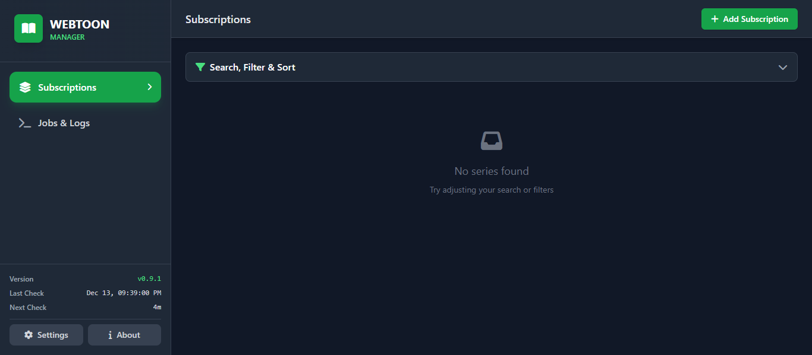
  </a>
</p>

### Features & Functionality

<p align="middle">
  <a href="demo_pics/add_subscription_modal.png" target="_blank">
    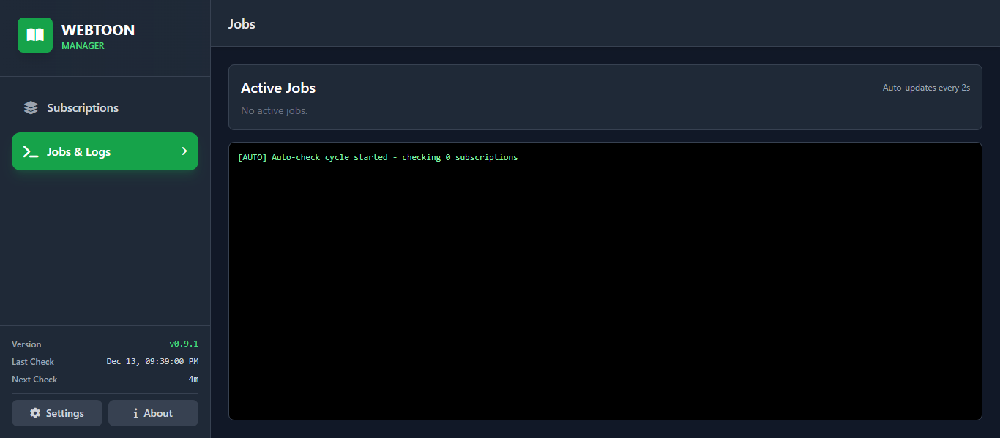
  </a>
  <a href="demo_pics/series_episodes_list.png" target="_blank">
    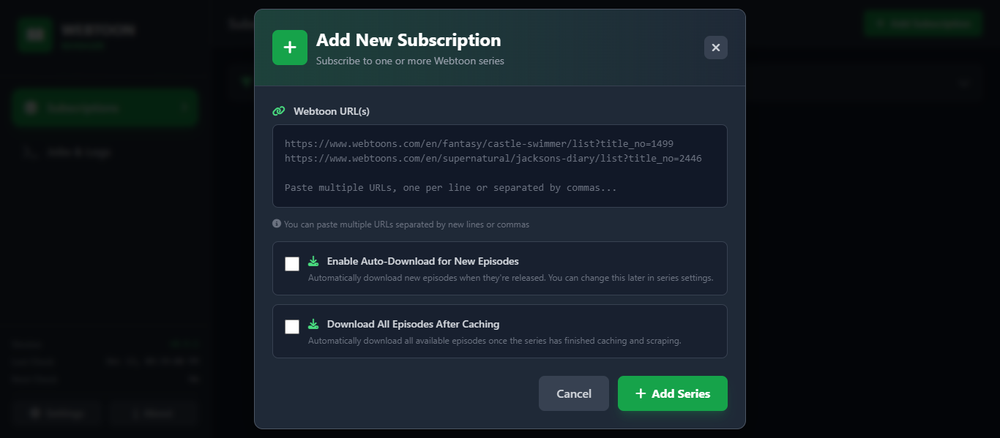
  </a>
  <a href="demo_pics/filter_and_search_toolbar.png" target="_blank">
    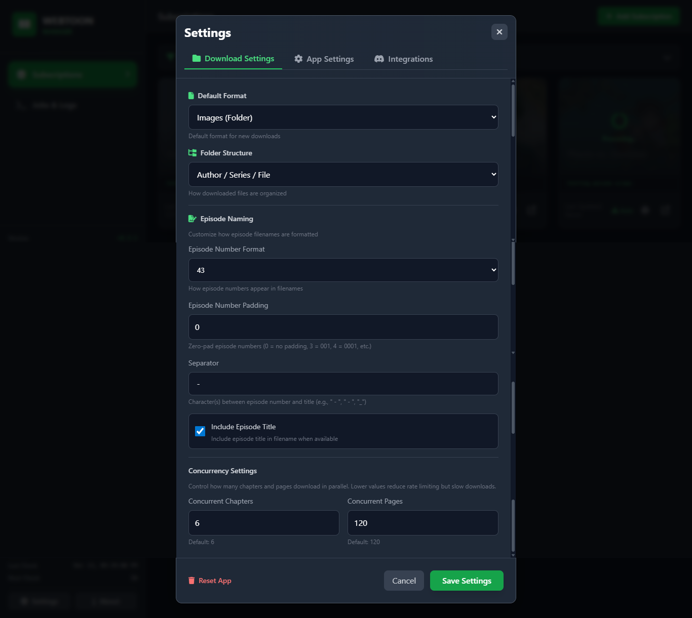
  </a>
  <a href="demo_pics/bulk_download_options.png" target="_blank">
    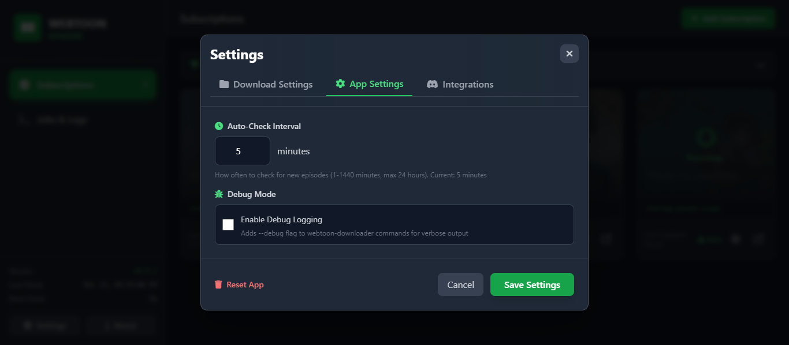
  </a>
  <a href="demo_pics/download_progress_display.png" target="_blank">
    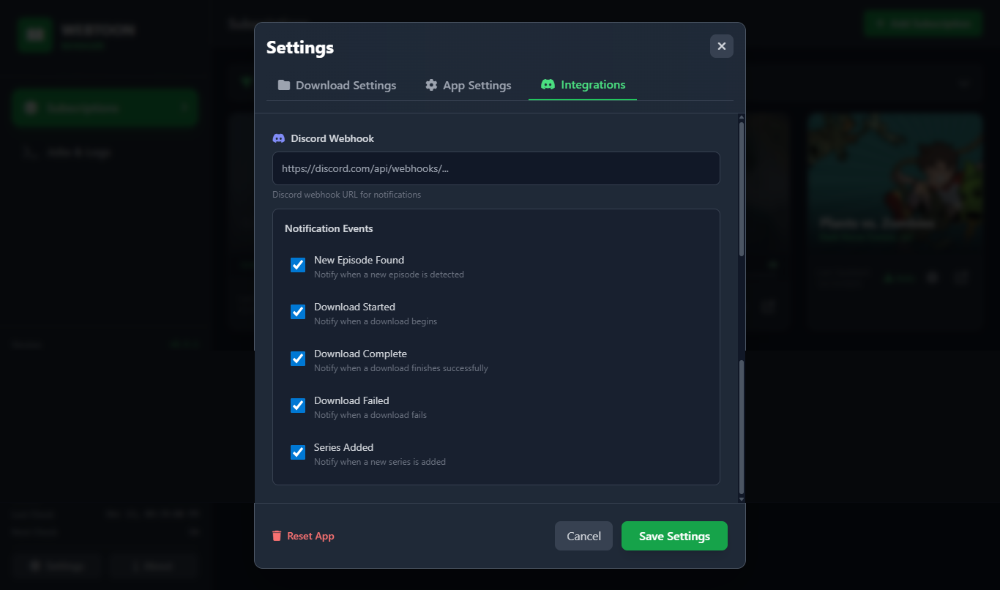
  </a>
  <a href="demo_pics/download_jobs_view.png" target="_blank">
    
  </a>
  <a href="demo_pics/jobs_logs_view.png" target="_blank">
    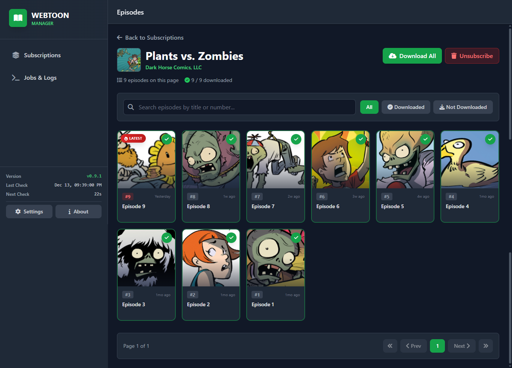
  </a>
  <a href="demo_pics/mobile_responsive_view.png" target="_blank">
    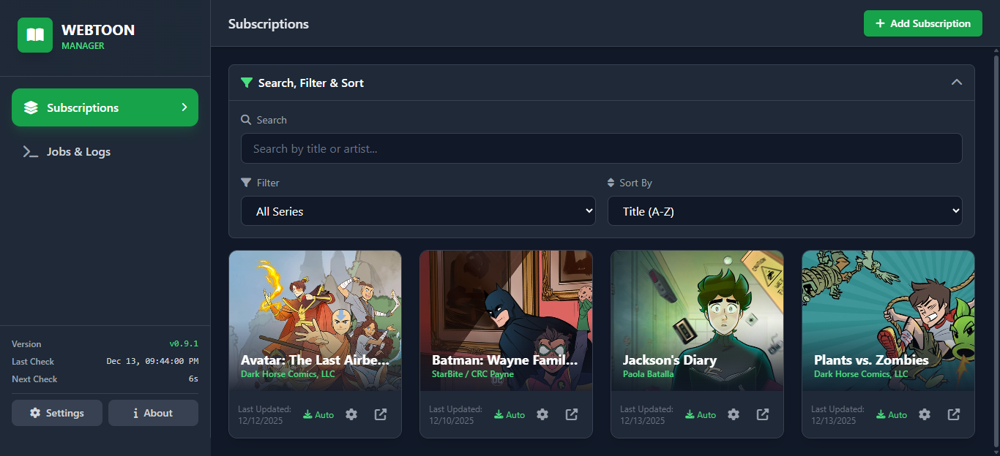
  </a>
</p>

### Settings & Configuration

<p align="middle">
  <a href="demo_pics/global_settings_modal.png" target="_blank">
    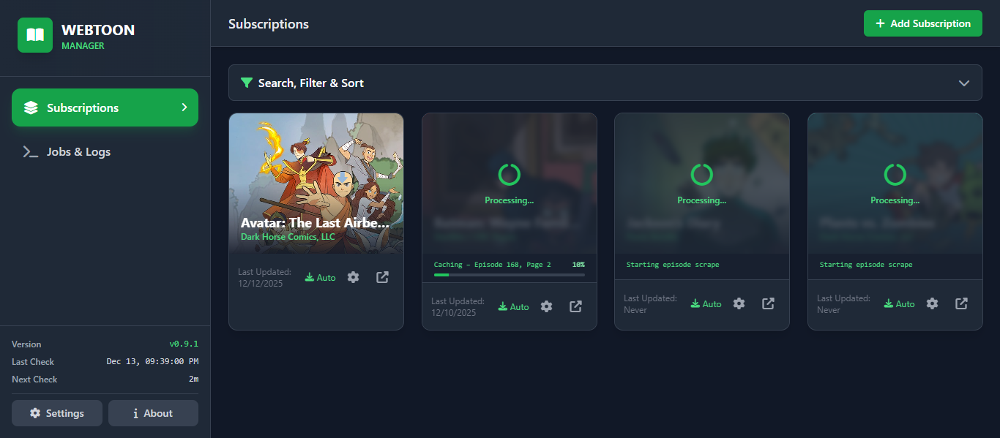
  </a>
  <a href="demo_pics/series_settings_modal.png" target="_blank">
    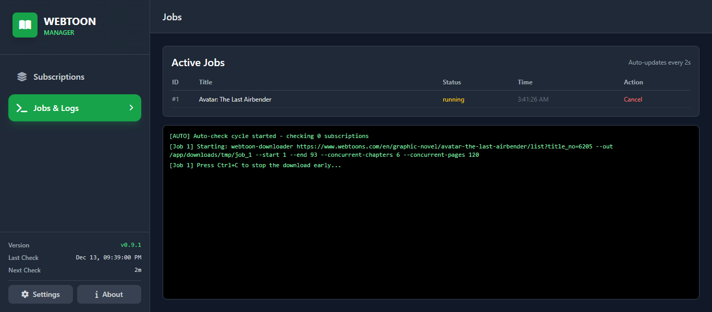
  </a>
</p>

### Extras

<p align="middle">
  <a href="demo_pics/readme_documentation_view.png" target="_blank">
    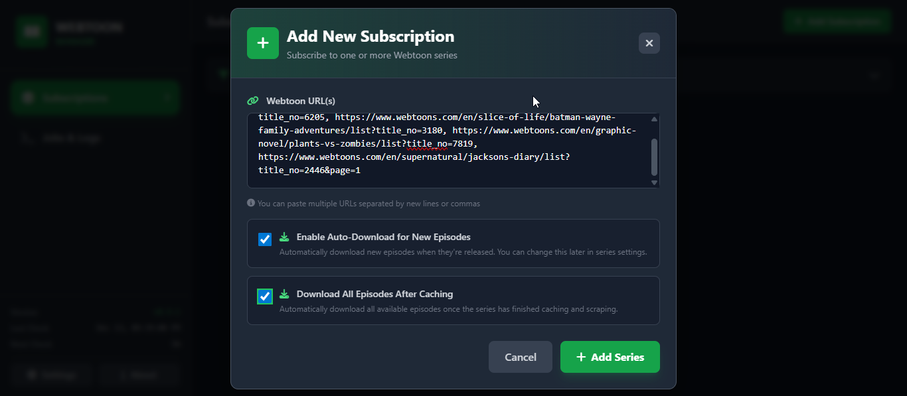
  </a>
  <a href="demo_pics/readme_features_section.png" target="_blank">
    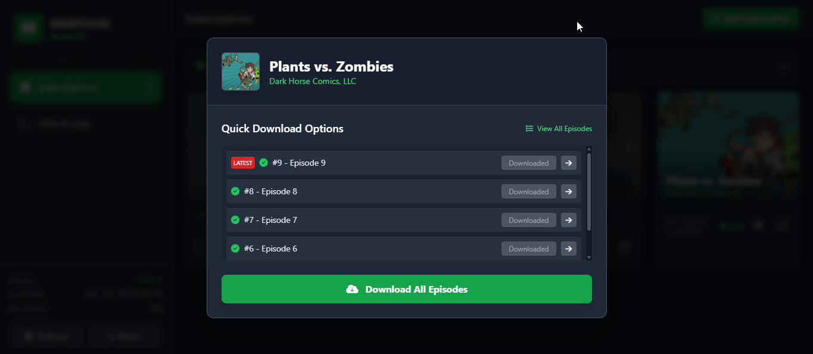
  </a>
  <a href="demo_pics/readme_installation_section.png" target="_blank">
    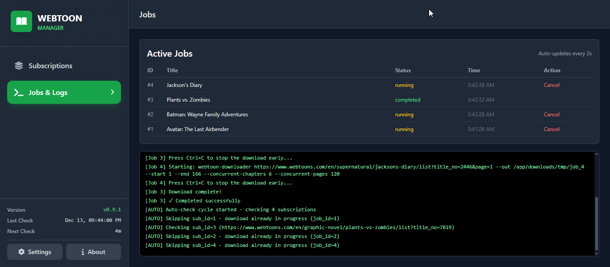
  </a>
</p>

## Prerequisites

- Python 3.11+ (for local development)
- Docker and Docker Compose (for containerized deployment)
- Internet connection for scraping and downloading webtoons

## Quick Start (Docker Compose)

The fastest way to get started is using Docker Compose:

```bash
# Clone the repository
git clone https://github.com/AKASGaming/webtoon-manager.git
cd webtoonhub

# Start the application
docker-compose up -d

# View logs (optional)
docker-compose logs -f

# Stop the application
docker-compose down
```

Access the web interface at `http://localhost:8128`

## Installation

### Using Docker Compose (Recommended)

1. Clone this repository:
   ```bash
   git clone https://github.com/AKASGaming/webtoon-manager.git
   cd webtoonhub
   ```

2. Start the application:
   ```bash
   docker-compose up -d
   ```

3. Access the web interface at `http://localhost:8128`

#### Docker Compose Configuration

The `docker-compose.yml` file is included in the repository:

```yaml
services:
  webtoon-manager:
    build: .
    container_name: webtoon_manager
    ports:
      - "8128:8128"
    volumes:
      - ./downloads:/app/downloads
      - ./db:/app/db  # Persist the SQLite database
      - ./cache/thumbnails:/app/cache/thumbnails
    restart: unless-stopped
```

**Volume Mounts:**
- `./downloads` - Stores all downloaded webtoon files
- `./db` - Persists the SQLite database
- `./cache/thumbnails` - Caches episode thumbnails for faster loading

**Ports:**
- `8128` - Web interface port (change if needed)

### Local Development

1. Clone this repository:
   ```bash
   git clone https://github.com/AKASGaming/webtoon-manager.git
   cd webtoonhub
   ```

2. Create a virtual environment:
   ```bash
   python -m venv venv
   source venv/bin/activate  # On Windows: venv\Scripts\activate
   ```

3. Install dependencies:
   ```bash
   pip install -r requirements.txt
   ```

4. Run the application:
   ```bash
   python app.py
   ```

6. Access the web interface at `http://localhost:8128`

## Usage

1. **Add a Series**: Enter a webtoon series URL to subscribe to it
2. **Configure Settings**: Set your preferred download format, path template, and auto-check interval
3. **Download Episodes**: Download individual episodes or use bulk download options
4. **Monitor Progress**: Track download progress and job status in real-time

## Project Structure

```
webtoonhub/
├── app.py                 # Main Flask application
├── requirements.txt       # Python dependencies
├── Dockerfile             # Docker image configuration
├── docker-compose.yml     # Docker Compose configuration
├── templates/
│   └── index.html         # Web interface
├── db/                    # SQLite database (created at runtime)
├── downloads/             # Downloaded files (created at runtime)
└── cache/                 # Cached thumbnails (created at runtime)
```

## Configuration

The application uses a SQLite database to store:
- Subscriptions (series you're tracking)
- Episodes (individual episodes for each series)
- Jobs (download job history)
- Settings (global and per-series preferences)

## Credits

This project uses the following open-source libraries and tools:

- **[webtoon-downloader](https://pypi.org/project/webtoon-downloader/)** - Core webtoon downloading functionality
- **[Flask](https://flask.palletsprojects.com/)** - Web framework for the application interface
- **[Beautiful Soup](https://www.crummy.com/software/BeautifulSoup/)** - HTML parsing and web scraping
- **[Requests](https://requests.readthedocs.io/)** - HTTP library for making web requests
- **[lxml](https://lxml.de/)** - XML and HTML parser

Special thanks to the developers and maintainers of these projects for making this application possible.

## Disclaimer

This tool is for personal use only. Please respect the terms of service of webtoon platforms and copyright holders. Only download content you have the right to access.
